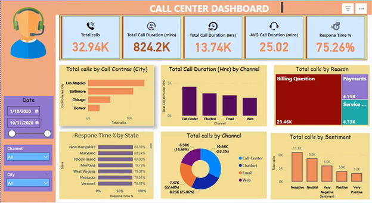

# Call-Center-Dashboard-PowerBI
An interactive Power BI dashboard analyzing call center performance across cities, channels, and states. It visualizes total calls, duration, customer sentiment, common reasons, and response times turning raw data into actionable insights to improve customer experience and service quality.

# 📞 Call Center Performance Dashboard — Power BI

  

---
---

### 📊 Key Insights
- **Total Calls by City & Channel** — Identify where most customer interactions occur.  
- **Call Duration Analysis** — Compare average handling times across voice, chat, web, and email.  
- **Customer Sentiment** — Understand satisfaction trends over time.  
- **Common Call Reasons** — Discover key drivers behind customer contacts.  
- **Response Time by State (%)** — Measure regional service performance and identify improvement areas.

---

### 🧠 Purpose
Data alone doesn’t drive change — visualizing it does.  
This dashboard empowers both technical and non-technical teams to make faster, data-driven decisions that enhance **customer experience** and **support efficiency**.

---

### ⚙️ Tools & Technologies
- **Power BI Desktop**
- **Excel / CSV Data Source**
- **DAX & Power Query**
- **Data Visualization Best Practices**

---

